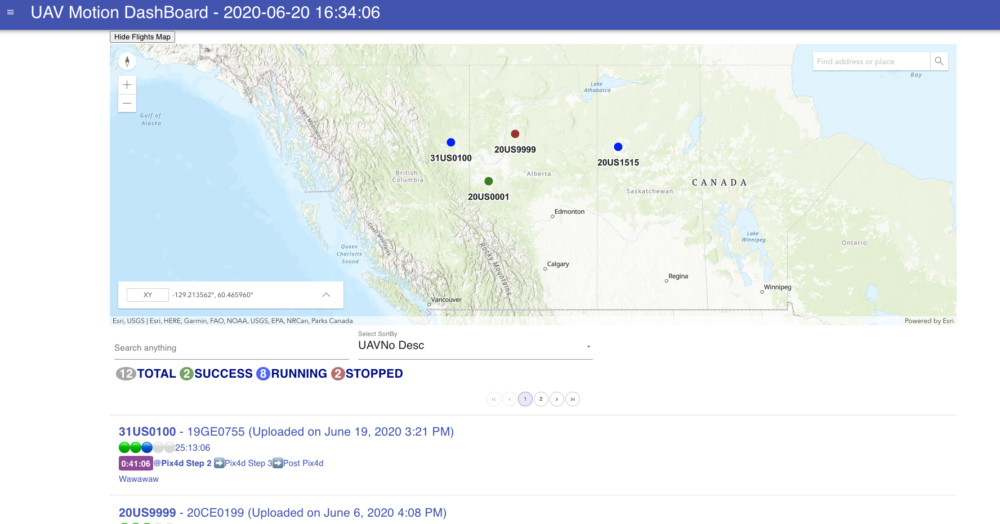

# UAVFlightDashboard
### Django, React, Material-UI, ArcGIS JavaScript API

The Dashboard for UAV Projects. Use Django REST framework as backend api, 
and React & Material-UI as frontend page.

steps:
1. git clone git@github.com:Jason-X-Git/UAVFlight.git.
2. cd backend/src.
3. python manage.py makemigrations.
4. python manage.py migrate.
1. Start backend:   
   cd backend/src && python manage.py runserver 0.0.0.0:8000
2. Start frontend:  
   cd frontend/gui && npm start  
   http://localhost:3000
    
    